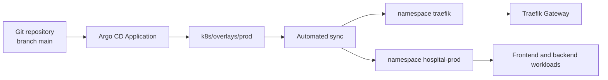
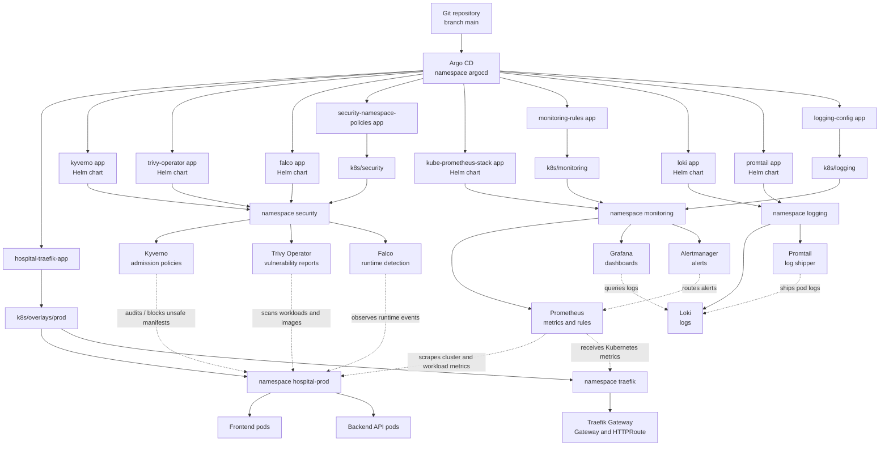
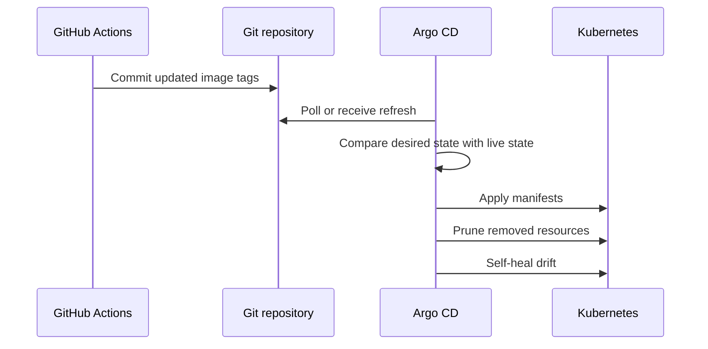
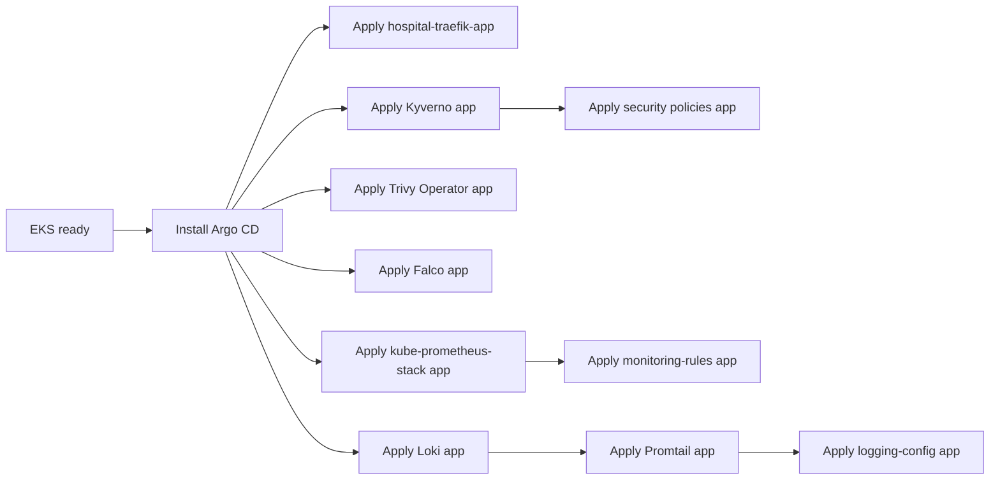

# Argo CD GitOps


This folder contains Argo CD `Application` manifests. These files tell Argo CD what to install or sync into the EKS cluster.

Argo CD is the desired-state controller for the cluster. Git is the source of truth, and manual cluster changes may be reverted when self-heal is enabled.

## Folder Responsibility

```text
argocd/ = GitOps installation and sync definitions
k8s/    = Kubernetes resources that run in the cluster
```

Examples:

| Argo CD path | What it does | Runtime path |
|---|---|---|
| `hospital-traefik-app.yaml` | Syncs the hospital app. | `k8s/base` |
| `security/10-kyverno-app.yaml` | Installs Kyverno from Helm. | `security` namespace |
| `security/00-security-namespace-policies-app.yaml` | Syncs Kyverno policies. | `k8s/security` |
| `monitoring/10-kube-prometheus-stack-app.yaml` | Installs Prometheus, Grafana, and Alertmanager from Helm. | `monitoring` namespace |
| `monitoring/20-monitoring-rules-app.yaml` | Syncs Prometheus alert rules. | `k8s/monitoring` |
| `logging/10-loki-app.yaml` | Installs Loki from Helm. | `logging` namespace |
| `logging/20-promtail-app.yaml` | Installs Promtail from Helm. | `logging` namespace |
| `logging/30-logging-config-app.yaml` | Syncs Loki datasource config. | `k8s/logging` |

## Learning Map

| Concept | Local example |
|---|---|
| App of apps mindset | Security, monitoring, and logging are represented as separate Argo CD Applications. |
| Helm through Argo CD | `security/*-app.yaml`, `monitoring/10-kube-prometheus-stack-app.yaml`, and `logging/*-app.yaml`. |
| Kustomize through Argo CD | `hospital-traefik-app.yaml`, `security-namespace-policies`, `monitoring-rules`, and `logging-config`. |
| Self-healing | Application specs use `syncPolicy.automated.selfHeal`. |
| Drift control | Application specs use `syncPolicy.automated.prune`. |

## Architecture



## Architecture With Security And Monitoring



Runtime model:

1. GitHub Actions updates image tags in Git after build and image scanning.
2. Argo CD syncs the app manifests from `k8s/base` into the `hospital` and `traefik` namespaces.
3. Argo CD also installs the security tools from `argocd/security`.
4. Kyverno checks Kubernetes resources at admission time. Policies are currently in `Audit` mode.
5. Trivy Operator scans live cluster workloads and produces vulnerability/config reports.
6. Falco watches running containers and reports suspicious runtime behavior.
7. Prometheus collects cluster metrics, Grafana visualizes them, and Alertmanager handles alerts.
8. Promtail ships pod logs to Loki, and Grafana uses Loki as a log datasource.

The important split is:

```text
argocd/security, argocd/monitoring, and argocd/logging = install/manage tools
k8s/security, k8s/monitoring, and k8s/logging          = configure those tools after they exist
```

## Files

| File | Purpose |
|---|---|
| `hospital-traefik-app.yaml` | Argo CD Application that syncs the Hospital Kubernetes stack from `k8s/base`. |
| `security/` | Argo CD Applications that install security tools and sync security config from `k8s/security`. |
| `monitoring/` | Argo CD Applications that install monitoring tools and sync monitoring config from `k8s/monitoring`. |
| `logging/` | Argo CD Applications that install logging tools and sync logging config from `k8s/logging`. |
| `SETUP.md` | Step-by-step Argo CD installation notes. |
| `images/` | Documentation images. |

## Application Configuration

| Setting | Value |
|---|---|
| Repository | `https://github.com/Kien-devops/eks-cicd-argocd-sec-monitor.git` |
| Target revision | `main` |
| Manifest path | `k8s/overlays/prod` |
| Destination server | `https://kubernetes.default.svc` |
| Destination namespace | `hospital-prod` |
| Automated sync | Enabled |
| Prune | Enabled |
| Self-heal | Enabled |

## Deployment Flow



## Bootstrap Order



## Apply the Application

Run on a host with cluster access:

```bash
kubectl apply -f argocd/hospital-traefik-app.yaml
```

Apply the security Applications:

```bash
kubectl apply -f argocd/security/10-kyverno-app.yaml
kubectl apply -f argocd/security/00-security-namespace-policies-app.yaml
kubectl apply -f argocd/security/20-trivy-operator-app.yaml
kubectl apply -f argocd/security/30-falco-app.yaml
```

Apply the monitoring Applications:

```bash
kubectl apply -f argocd/monitoring/10-kube-prometheus-stack-app.yaml
kubectl apply -f argocd/monitoring/20-monitoring-rules-app.yaml
```

Apply the logging Applications:

```bash
kubectl apply -f argocd/logging/10-loki-app.yaml
kubectl apply -f argocd/logging/20-promtail-app.yaml
kubectl apply -f argocd/logging/30-logging-config-app.yaml
```

## Access the Argo CD UI

Port-forward the API server:

```bash
kubectl port-forward svc/argocd-server -n argocd 8080:443 --address 0.0.0.0
```

Open:

```text
https://<server-ip>:8080
```

Get the initial admin password:

```bash
kubectl -n argocd get secret argocd-initial-admin-secret -o jsonpath="{.data.password}" | base64 -d
echo
```

## Verify Sync

```bash
kubectl -n argocd get applications
kubectl -n argocd describe application hospital-traefik-app
kubectl -n argocd get application kyverno trivy-operator falco security-namespace-policies
kubectl -n argocd get application kube-prometheus-stack monitoring-rules
kubectl -n argocd get application loki promtail logging-config
kubectl get pods -n hospital
kubectl get pods -n traefik
kubectl get pods -n security
kubectl get pods -n monitoring
kubectl get pods -n logging
kubectl get clusterpolicy
kubectl get vulnerabilityreports -A
kubectl get prometheusrule -n monitoring
kubectl get gateway,httproute -n hospital
```

Access Grafana:

```bash
kubectl port-forward -n monitoring svc/kube-prometheus-stack-grafana 3000:80
```

Open:

```text
http://localhost:3000
```

If you use the Argo CD CLI:

```bash
argocd app get hospital-traefik-app
argocd app sync hospital-traefik-app
```

## Operational Notes

| Topic | Guidance |
|---|---|
| Manual edits | Avoid `kubectl edit` for managed resources. Commit the change to Git instead. |
| Runtime secrets | Keep secrets such as `be-db-secret` created separately in the cluster. |
| Image deployment | GitHub Actions updates image tags in Git, then Argo CD syncs. |
| Drift | Self-heal will bring live resources back to Git state. |
| Prune | Deleted manifests can delete live resources during sync. Review changes carefully. |

## Troubleshooting

| Symptom | Check |
|---|---|
| Application is OutOfSync | Review changed resources and sync status. |
| Application is Degraded | Inspect pod status, events, and CRD readiness. |
| Sync fails on Gateway resources | Gateway API CRDs and Traefik CRDs must exist. |
| Image pull errors after sync | ECR secret, ECR tag, worker registry access. |
| Manual changes disappear | Expected behavior when self-heal is enabled. |
