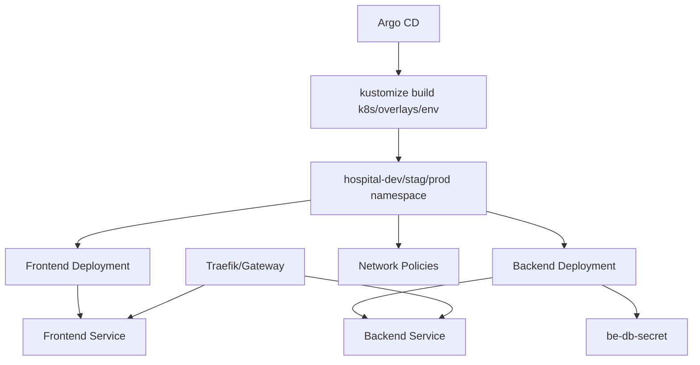
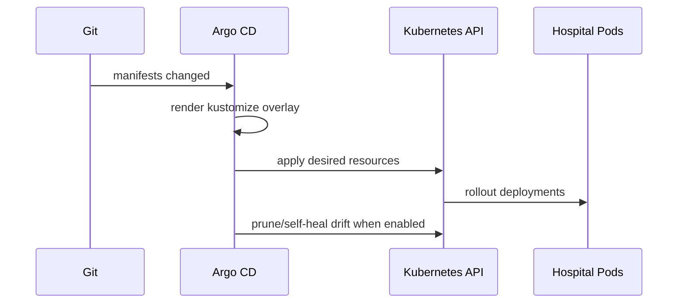

# Kubernetes Manifests


This folder contains the Kubernetes runtime manifests deployed by Argo CD.

The `k8s/` folder is the runtime layer. It contains resources that run in, or configure things inside, the Kubernetes cluster. Argo CD Application manifests live in `argocd/`.

## Learning Map

| Topic | Where it appears |
|---|---|
| Application runtime | `k8s/base` |
| Environment overlays | `k8s/overlays/dev`, `k8s/overlays/stag`, `k8s/overlays/prod` |
| Cluster security configuration | `k8s/security` |
| Cluster monitoring configuration | `k8s/monitoring` |
| Cluster logging configuration | `k8s/logging` |
| GitOps installer layer | `argocd/` |

## Architecture



## Deployment Workflow



## Structure

```text
k8s/
  base/
    kustomization.yaml
    05-fe-deployment.yaml
    06-fe-service.yaml
    07-be-deployment.yaml
    08-be-service.yaml
    10-network-policy.yaml
  overlays/
    dev/
      namespace.yaml
      kustomization.yaml
    stag/
      namespace.yaml
      kustomization.yaml
    prod/
      namespace.yaml
      kustomization.yaml
  secrets/
    default-connection.txt.example
  security/
    namespace.yaml
    policies/
  monitoring/
    namespace.yaml
    rules/
  logging/
    namespace.yaml
    grafana-loki-datasource.yaml
```

## Runtime Responsibility

| Path | Purpose | Installed or synced by |
|---|---|---|
| `k8s/base` | Hospital frontend/backend runtime resources. | `argocd/hospital-traefik-app.yaml` |
| `k8s/overlays/*` | Environment-specific replica/image overrides. | Manual apply or future environment-specific Argo CD apps. |
| `k8s/security` | Kyverno policies and security namespace. | `argocd/security/00-security-namespace-policies-app.yaml` |
| `k8s/monitoring` | Prometheus rules and monitoring namespace. | `argocd/monitoring/20-monitoring-rules-app.yaml` |
| `k8s/logging` | Logging namespace and Grafana Loki datasource. | `argocd/logging/30-logging-config-app.yaml` |

## Environments

| Environment | Path | Namespace | Replicas |
|---|---|---|---|
| dev | `k8s/overlays/dev` | `hospital-dev` | 1 frontend, 1 backend |
| stag | `k8s/overlays/stag` | `hospital-stag` | 2 frontend, 2 backend |
| prod | `k8s/overlays/prod` | `hospital-prod` | 3 frontend, 3 backend |

## Apply Manually

```bash
kubectl apply -k k8s/overlays/dev
kubectl apply -k k8s/overlays/stag
kubectl apply -k k8s/overlays/prod
```

## Required Secrets

Create these before deploying the backend:

```bash
cp k8s/secrets/default-connection.txt.example k8s/secrets/default-connection.txt
vi k8s/secrets/default-connection.txt

kubectl apply -f k8s/overlays/dev/namespace.yaml
kubectl -n hospital-dev create secret generic be-db-secret \
  --from-file=default-connection=k8s/secrets/default-connection.txt \
  --dry-run=client -o yaml | kubectl apply -f -
```

`k8s/secrets/default-connection.txt` is ignored by Git. Keep the real host, database name, user, and password only in that local file or in your cluster secret manager.

If images are private in ECR, create an image pull secret or configure worker node IAM/ECR access:

```bash
kubectl -n hospital-dev create secret docker-registry ecr-registry-secret \
  --docker-server=<account-id>.dkr.ecr.<region>.amazonaws.com \
  --docker-username=AWS \
  --docker-password="$(aws ecr get-login-password --region <region>)"
```

## Verify

```bash
kubectl get pods,svc -n hospital-dev
kubectl describe deploy be-deployment-v1 -n hospital-dev
kubectl describe deploy fe-deployment-v1 -n hospital-dev
```
