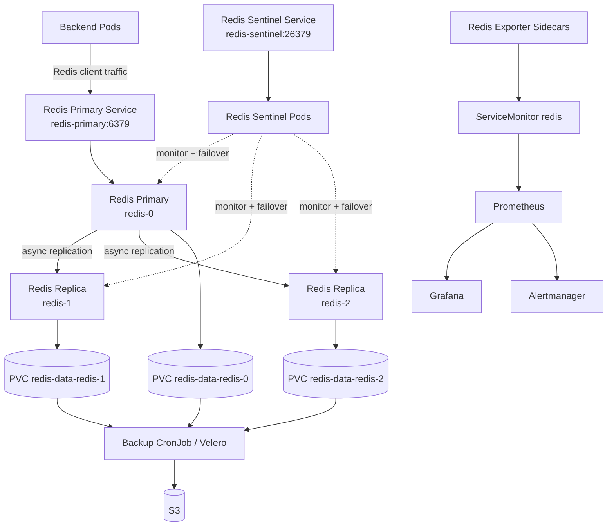

# Redis For Hospital Workloads

This folder deploys Redis for the `hospital-prod` namespace.

## Architecture



Sentinel-aware clients should connect to `redis-sentinel:26379` and discover the current primary named `mymaster`. Simple clients can use `redis-primary:6379`, but failover handling depends on client reconnect behavior.

## Files

| File | Purpose |
|---|---|
| `10-redis-configmap.yaml` | Redis and Sentinel startup scripts. |
| `20-redis-services.yaml` | Headless, primary, sentinel, and metrics services. |
| `30-redis-statefulset.yaml` | Three Redis pods with Redis, Sentinel, and exporter containers. |
| `40-redis-servicemonitor.yaml` | Prometheus scrape configuration for redis-exporter. |
| `50-redis-networkpolicy.yaml` | Allows app traffic and Prometheus scraping. |
| `redis-auth-secret.example.yaml` | Example password secret. Apply a real secret separately. |
| `backend-redis-secret.example.yaml` | Example backend Redis connection string secret. |
| `70-redis-backup-cronjob.example.yaml` | Optional S3 backup CronJob example. |

## Storage

Redis PVCs use the dedicated EBS StorageClass:

```text
redis-ebs-gp3
```

That StorageClass is defined in:

```text
k8s/storage/redis-ebs-gp3-storageclass.yaml
```

Install the AWS EBS CSI Driver before deploying Redis. The EBS CSI controller must have AWS credentials, normally from an IAM role attached to the EC2 nodes.

Apply storage first:

```bash
kubectl apply -k k8s/storage
```

Verify:

```bash
kubectl get storageclass redis-ebs-gp3
kubectl get pod -n kube-system -l app.kubernetes.io/name=aws-ebs-csi-driver
```

## Create The Redis Secret

Do not commit the real password to Git.

```bash
kubectl create secret generic redis-auth-secret \
  -n hospital-prod \
  --from-literal=password='<strong-password>' \
  --dry-run=client -o yaml | kubectl apply -f -
```

## Deploy

```bash
kubectl apply -k k8s/storage
kubectl apply -k k8s/redis
```

Verify:

```bash
kubectl get pods,svc,pvc -n hospital-prod -l app.kubernetes.io/name=redis
kubectl get servicemonitor -n hospital-prod redis
```

If Redis was created before `storageClassName: redis-ebs-gp3` was added, recreate the StatefulSet and pending PVC:

```bash
kubectl delete statefulset redis -n hospital-prod --cascade=orphan
kubectl delete pod redis-0 -n hospital-prod
kubectl delete pvc redis-data-redis-0 -n hospital-prod
kubectl apply -k k8s/storage
kubectl apply -k k8s/redis
```

Watch EBS provisioning:

```bash
kubectl get pvc -n hospital-prod -w
kubectl get pv
```

## Application Connection

For simple clients:

```text
redis-primary.hospital-prod.svc.cluster.local:6379
```

For Sentinel-aware clients:

```text
Sentinel service: redis-sentinel.hospital-prod.svc.cluster.local:26379
Master name: mymaster
```

Sentinel-aware clients are preferred for failover behavior.

## Backend Configuration

The backend reads Redis from:

```text
ConnectionStrings__Redis
```

Create the backend Redis secret before rolling out the backend:

```bash
kubectl create secret generic be-redis-secret \
  -n hospital-prod \
  --from-literal=connection-string='redis-primary.hospital-prod.svc.cluster.local:6379,password=<strong-password>,abortConnect=false' \
  --dry-run=client -o yaml | kubectl apply -f -
```

The backend exposes a Redis health endpoint:

```text
/healthz/redis
```

Test from inside the cluster or through the backend service/ingress:

```bash
curl http://<backend-host>/healthz/redis
```

## Check Redis

```bash
kubectl exec -n hospital-prod redis-0 -c redis -- redis-cli -a '<strong-password>' ping
kubectl exec -n hospital-prod redis-0 -c sentinel -- redis-cli -p 26379 sentinel masters
kubectl exec -n hospital-prod redis-1 -c redis -- redis-cli -a '<strong-password>' info replication
```

## Metrics

The exporter listens on port `9121` and is scraped through `ServiceMonitor/redis`.

Useful Prometheus queries:

```text
redis_up
redis_connected_clients
redis_memory_used_bytes
redis_connected_slaves
redis_master_link_up
```

## Backup

`70-redis-backup-cronjob.example.yaml` is intentionally not included in `kustomization.yaml`.

To enable it, create a secret for S3 first:

```bash
kubectl create secret generic redis-backup-s3-secret \
  -n hospital-prod \
  --from-literal=bucket='<s3-bucket-name>' \
  --from-literal=region='<aws-region>' \
  --dry-run=client -o yaml | kubectl apply -f -
```

If the pod does not use an IAM role, also provide AWS access keys:

```bash
kubectl create secret generic redis-backup-s3-secret \
  -n hospital-prod \
  --from-literal=bucket='<s3-bucket-name>' \
  --from-literal=region='<aws-region>' \
  --from-literal=access-key-id='<aws-access-key-id>' \
  --from-literal=secret-access-key='<aws-secret-access-key>' \
  --dry-run=client -o yaml | kubectl apply -f -
```

Then apply the example:

```bash
kubectl apply -f k8s/redis/70-redis-backup-cronjob.example.yaml
```
