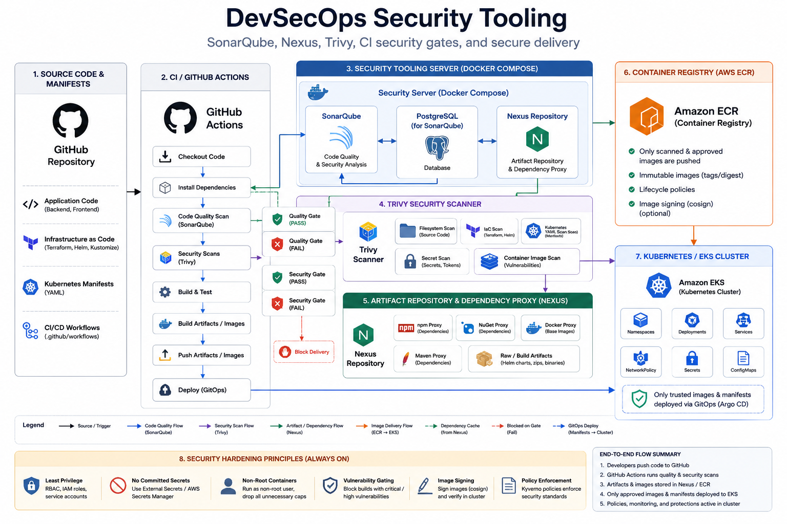
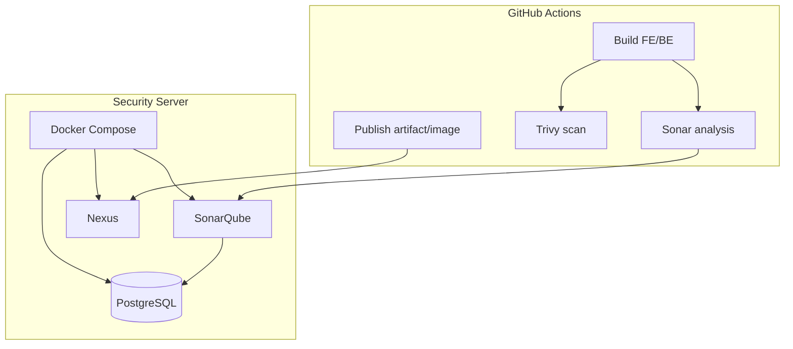
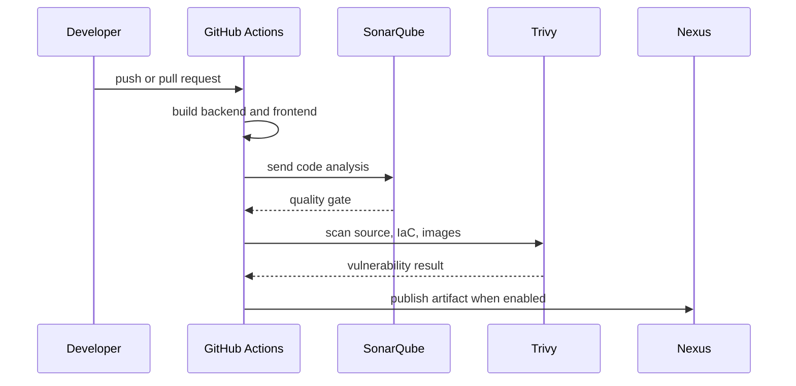

# DevSecOps Security Tooling


This folder contains the security servers and scan tooling used by the Hospital EKS GitOps platform.



## Learning Map

| Topic | Tool |
|---|---|
| Code quality and hotspots | SonarQube |
| Dependency and image vulnerability scanning | Trivy |
| IaC and Kubernetes manifest scanning | Trivy |
| Artifact repository and dependency proxy | Nexus |
| CI/CD security gate | GitHub Actions |

## Tooling

| Tool | Path | Purpose |
|---|---|---|
| SonarQube | `sonarqube/` | Static analysis, code quality, security hotspots, quality gates. |
| Nexus Repository | `nexus/` | Private artifact repository and dependency proxy. |
| Trivy | `trivy/` | Vulnerability, secret, IaC, and container image scanning. |

## Architecture



## Workflow



## Quick Start

```bash
cd security
docker compose up -d
docker compose ps
```

Open only from the server itself by default:

| Service | URL |
|---|---|
| SonarQube | `http://<host-ip-address>:9000` |
| Nexus | `http://<host-ip-address>:8081` |

To expose these services to another host, put Nginx, Caddy, Traefik, or an AWS ALB in front of them and enable HTTPS.

## Environment Files

`.env` files are included as editable placeholders:

| File | Purpose |
|---|---|
| `security/.env` | Docker Compose ports and SonarQube database settings. |
| `security/sonarqube/.env` | SonarQube URL/token placeholders. |
| `security/nexus/.env` | Nexus URL and credential placeholders. |
| `security/trivy/.env` | Trivy scan policy placeholders. |

Use real secrets in GitHub Actions secrets or a secret manager for production.

## Server Hardening

```bash
sudo apt update
sudo apt install -y curl uidmap dbus-user-session ufw fail2ban
sudo ufw allow OpenSSH
sudo ufw enable
```

Install Docker and enable rootless mode:

```bash
curl -fsSL https://get.docker.com | sudo sh
dockerd-rootless-setuptool.sh install
systemctl --user enable docker
systemctl --user start docker
sudo loginctl enable-linger "$USER"
docker --version
```

## CI/CD Gate

Typical order:

```text
Build -> Unit Test -> SonarQube Analysis -> Trivy Scan -> Publish artifact/image -> Argo CD Deploy
```

Minimum policy:

| Gate | Expected result |
|---|---|
| Build | FE/BE compile successfully. |
| SonarQube | Quality gate passes. |
| Trivy | No unapproved HIGH/CRITICAL findings. |
| Nexus | Artifacts publish with CI credentials only. |

## Documentation

- `sonarqube/README.md`
- `nexus/README.md`
- `trivy/README.md`
- `HARDENING.md`
- `SETUP.md`
